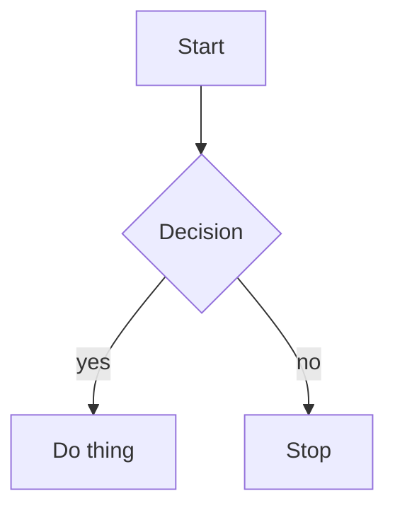

# Heading One

## Heading Two

### Heading Three

#### Heading Four

Some paragraph with **bold**, *italic*, `code span`, ~~strike~~, <https://auto.link> and a [link](https://example.com).

> [!NOTE]
> This is a GFM callout.

- item one
- item two
  - nested item
- [ ] todo task
- [x] done task

> A blockquote line

```lua
local x = 42
print(x)
```

| Name | Value |
| ---- | ----- |
| foo  | 1     |
| bar  | 2     |

| 단축키 | 기능 |
| --- | --- |
| <Leader>e | Neo-tree 파일 탐색기 토글 |
| \ | 수직 분할 |
| <C-h/j/k/l> | 창 간 이동 |

---



The end.
