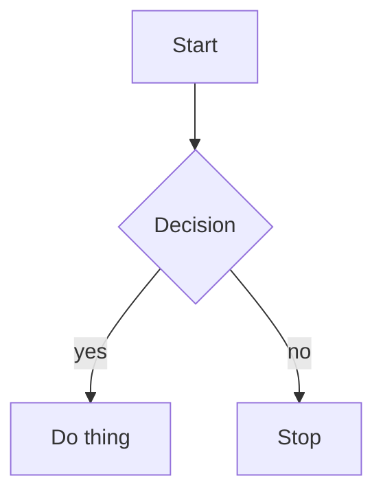

# Heading One

## Heading Two

Some paragraph with **bold**, *italic*, `code span` and a [link](https://example.com).

- item one
- item two
  - nested item
- [ ] todo task
- [x] done task

> A blockquote line

```lua
local x = 42
print(x)
```

| Name | Value |
| ---- | ----- |
| foo  | 1     |
| bar  | 2     |

---



The end.
